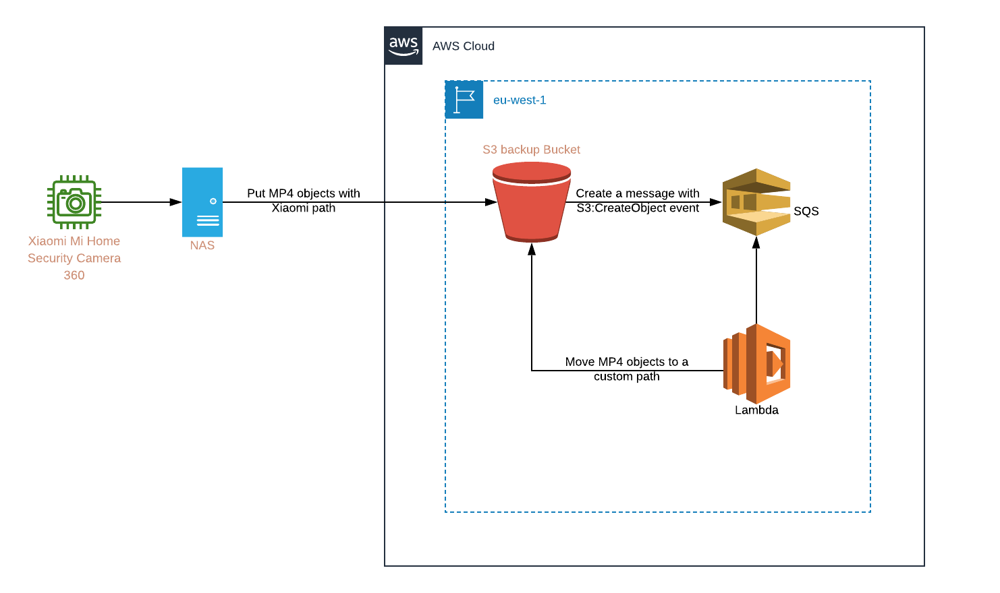

# Project to use for create 'backup-mi360-to-s3' infrastructure

## How to create/destroy the infrastructure

### 1. Initialise you environmernt

```shell
aws configure
```

### 2. Create the infrastructure

```shell
terraform apply
```

### 3. Destroy the infrastructure

```shell
terraform destroy
```

## Dependencies of the infrastructure

* The project is built with the [v0.12.12](https://releases.hashicorp.com/terraform/) of Terraform

## Inputs

| Name | Description | Type | Default | Required |
|------|-------------|:----:|:-----:|:-----:|
| region | Region to use for create the infrastructure (default: Paris) | string | `"eu-west-3"` | no |
| name | Default tags name to be applied on the infrastructure for the resources names| map | `...` | no |
| tags | Default tags to be applied on the infrastructure | map | `...` | no |

## Outputs

| Name | Description |
|------|-------------|
| api\_path | API path to call the lambda |
| bucket\_name | Bucket name of the project |
| sqs\_url | SQS URL |
| lambda\_arn | Lambda ARN |

## AWS architecture diagram



## Author

* [**Mohamed BASRI**](https://github.com/mbasri)

## License

This project is licensed under the MIT License - see the [LICENSE](./LICENSE) file for details
